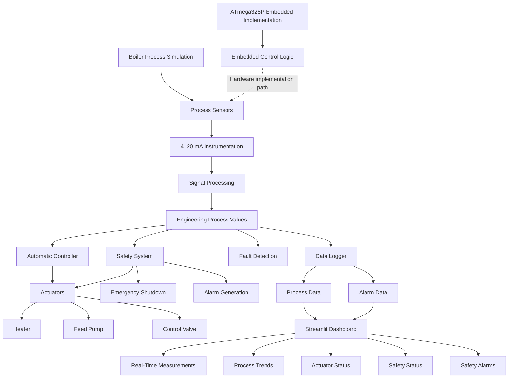

# Industrial Boiler Monitoring, Control and Safety System

An industrial boiler monitoring, control, and safety system designed to continuously monitor temperature, pressure, water level, and flow; process instrumentation signals; automatically control boiler actuators; detect abnormal operating conditions; initiate emergency shutdown; log process data; and provide a real-time monitoring dashboard.

The project combines process simulation, industrial-style instrumentation, 4–20 mA signal processing, automatic control, safety interlocks, fault detection, data logging, an ATmega328P embedded implementation, Wokwi simulation, automated testing, and a Streamlit-based monitoring dashboard.

---

## Project Overview

Industrial boilers operate under continuously changing temperature, pressure, water-level, and flow conditions. Failure to detect abnormal conditions can result in equipment damage or unsafe operation.

This project demonstrates a complete monitoring and control architecture in which process variables are measured, represented through industrial-style instrumentation signals, processed into engineering values, evaluated by the safety system, and used by the controller to operate actuators.

The project also includes an ATmega328P-based embedded implementation and Wokwi hardware simulation to demonstrate how the software control concept can be transferred toward a microcontroller-based system.

A Streamlit dashboard provides real-time visualization of the Python-based boiler process simulation.

---

## Main Features

- Real-time temperature monitoring
- Pressure monitoring
- Water-level monitoring
- Flow monitoring
- 4–20 mA instrumentation simulation
- Signal processing and engineering-unit conversion
- Automatic heater control
- Automatic feed-pump control
- Control-valve operation
- Safety interlocks
- High-pressure emergency shutdown
- High-temperature protection
- Low-water-level protection
- Low-flow protection
- Safety-trip latching
- Manual safety reset
- Fault injection and recovery
- Sensor fault detection
- Anomaly detection
- Process-data logging
- Alarm logging
- Real-time Streamlit dashboard
- ATmega328P embedded implementation
- Wokwi hardware simulation
- Automated unit, integration, and end-to-end testing

---

## System Architecture



---

## Process Variables

The system monitors four primary process variables.

| Variable | Unit | Purpose |
|---|---|---|
| Temperature | °C | Monitors boiler thermal condition |
| Pressure | bar | Detects pressure buildup and unsafe conditions |
| Water Level | % | Maintains safe boiler water level |
| Flow | L/min | Monitors process/feed flow |

These variables are continuously updated by the process simulation and evaluated by the controller and safety system.

---

## Instrumentation

The project includes an industrial-style instrumentation layer.

The simulated process measurements are represented using a 4–20 mA transmitter model and converted back into engineering values through signal processing.

```text
Process Variable
       |
       v
Sensor Measurement
       |
       v
4–20 mA Transmitter
       |
       v
Signal Processing
       |
       v
Engineering Units
       |
       v
Control / Safety System
```

This provides a simplified representation of how industrial field instrumentation interfaces with control and monitoring systems.

---

## Automatic Control

The boiler controller automatically determines actuator operation based on measured process conditions and the current safety state.

### Controlled Actuators

- Heater
- Feed pump
- Control valve

### Control Flow

```text
Process Measurements
        |
        v
Automatic Controller
        |
        +------> Heater
        |
        +------> Feed Pump
        |
        +------> Control Valve
```

The controller operates normally only when the safety system permits normal operation.

During an emergency condition, the safety system overrides normal control operation and places the process into a safe state.

---

## Safety System

Safety is given priority over normal process control.

The safety system continuously evaluates process conditions and can override normal controller operation when critical limits are exceeded.

### Safety Limits

| Parameter | Safety Limit |
|---|---:|
| Maximum Temperature | 210 °C |
| Maximum Pressure | 10 bar |
| Minimum Water Level | 20 % |
| Minimum Flow | 10 L/min |

### Safety Functions

- High-temperature detection
- High-pressure detection
- Low-water-level detection
- Low-flow detection
- Emergency shutdown
- Safety-trip latching
- Alarm generation
- Safe actuator state
- Controlled manual reset

### Safety Sequence

```text
Normal Operation
       |
       v
Process Monitoring
       |
       v
Abnormal Condition
       |
       v
Safety Evaluation
       |
       v
Emergency Trip
       |
       +----> Heater OFF
       |
       +----> Pump OFF
       |
       +----> Valve OPEN
       |
       +----> Alarm ON
       |
       v
Safety Trip Latched
       |
       v
Condition Restored
       |
       v
Controlled Manual Reset
       |
       v
Normal Operation
```

The safety-trip latch prevents automatic restart after a critical safety event.

---

## Fault Detection

The project includes controlled fault injection and abnormal-condition detection for safety validation.

### Supported Fault Conditions

- High-pressure fault
- High-temperature fault
- Low-water-level fault
- Low-flow fault
- Sensor-related abnormal conditions
- Safety-trip conditions

Example fault injection:

```python
from simulation.boiler import BoilerSimulator

boiler = BoilerSimulator()

boiler.inject_fault("high_pressure")

print(boiler.get_sensor_data())
```

The safety system detects the injected condition and transitions to the emergency state.

---

## Emergency Shutdown

A critical abnormal condition causes the safety system to latch an emergency trip.

Example:

```text
High Pressure
     |
     v
Safety Limit Exceeded
     |
     v
EMERGENCY
     |
     +----> Heater OFF
     |
     +----> Pump OFF
     |
     +----> Valve OPEN
     |
     +----> Alarm ON
     |
     v
TRIP LATCHED
```

The emergency state cannot be automatically cleared while unsafe process conditions remain.

A controlled reset is permitted only after the monitored process variables return to safe operating ranges.

---

## Data Logging

Process data is continuously recorded during simulation.

### Process Data

```text
data/process_data.csv
```

### Alarm Data

```text
logs/alarms.csv
```

Logged information includes:

- Timestamp
- Simulation cycle
- Temperature
- Pressure
- Water level
- Flow
- Heater state
- Pump state
- Control-valve position
- Safety state
- Alarm information

Generated runtime data should not be committed to the repository unnecessarily.

---

## Real-Time Monitoring Dashboard

The project includes a Streamlit dashboard located at:

```text
app/dashboard.py
```

The dashboard displays:

- Temperature
- Pressure
- Water level
- Flow
- Heater status
- Feed-pump status
- Control-valve position
- Safety status
- Safety alarms
- Simulation cycle
- Real-time process trends
- Data logging information

### Dashboard Architecture

```text
BoilerSimulator
       |
       v
SafetySystem
       |
       v
BoilerController
       |
       +----------------+
       |                |
       v                v
Process State       Actuator State
       |                |
       +-------+--------+
               |
               v
          Data Logging
               |
               v
       Streamlit Dashboard
```

The Streamlit dashboard uses the Python boiler simulation, controller, and safety-system modules directly.

### Run Dashboard

```bash
streamlit run app/dashboard.py
```

The dashboard normally becomes available at:

```text
http://localhost:8501
```

### Dashboard Access

[Open Local Streamlit Dashboard](http://localhost:8501)

> The localhost dashboard is available only while the Streamlit application is running on the local machine. It is not a publicly hosted web application.

---

## Wokwi ATmega328P Simulation

The project also includes an ATmega328P-based embedded implementation.

### Embedded Files

```text
sketch.ino
diagram.json
```

The embedded implementation demonstrates the transition from a Python-based process simulation toward a microcontroller-based monitoring and control system.

The embedded design can be extended to physical:

- Temperature sensors
- Pressure transmitters
- Water-level sensors
- Flow sensors
- 4–20 mA receiver circuits
- ADC signal-conditioning circuits
- Relay or MOSFET actuator drivers
- Heater/load representation
- Pump
- Solenoid/control valve
- LCD display
- Buzzer
- Emergency-stop circuitry

### Wokwi Simulation

The ATmega328P implementation can be simulated using Wokwi.

[Open Wokwi Arduino Project](https://wokwi.com/projects/new/arduino-uno)

> The provided Wokwi URL opens an Arduino Uno project entry point. A saved Wokwi project URL containing the final boiler implementation can replace this link when the final Wokwi project is published.

### Important Architecture Note

The current Wokwi implementation and Streamlit dashboard are **separate demonstrations**.

```text
Wokwi / ATmega328P
        |
        v
Embedded Control Implementation
```

and:

```text
Python Boiler Simulator
        |
        v
Instrumentation
        |
        v
Controller + Safety System
        |
        v
Data Logger
        |
        v
Streamlit Dashboard
```

The current project does not claim a live serial connection between the Wokwi ATmega328P simulation and the Streamlit dashboard.

---

## Software Structure

```text
industrial-boiler-monitoring/
|
├── app/
│   └── dashboard.py
|
├── control/
│   ├── __init__.py
│   └── controller.py
|
├── data/
│   ├── boiler_training_dataset.csv
│   ├── generate_dataset.py
│   └── process_data.csv
|
├── fault_detection/
│   ├── __init__.py
│   └── anomaly_detector.py
|
├── instrumentation/
│   ├── __init__.py
│   ├── sensors.py
│   └── signal_processing.py
|
├── logs/
│   ├── boiler_data.csv
│   └── data_logger.py
|
├── models/
│   └── boiler_anomaly_model.pkl
|
├── safety/
│   ├── __init__.py
│   └── safety_system.py
|
├── simulation/
│   ├── __init__.py
│   └── boiler.py
|
├── tests/
│   ├── __init__.py
│   ├── test_end_to_end.py
│   ├── test_integration.py
│   └── test_system.py
|
├── diagram.json
├── requirements.txt
├── README.md
└── sketch.ino
```

---

## Technologies Used

### Hardware / Embedded

- ATmega328P
- Simulated process sensors
- Wokwi

### Programming

- Python
- C/C++ for embedded implementation

### Python Libraries

- Pandas
- Streamlit
- Plotly
- Scikit-learn
- Joblib
- Pytest

### Development Tools

- Git
- GitHub
- Wokwi
- Python Virtual Environment

---

## Testing

The project includes automated unit, integration, and end-to-end tests.

### Test Coverage

Tests cover:

- Boiler simulation
- Sensor behavior
- Instrumentation
- 4–20 mA signal processing
- Controller behavior
- Safety system
- Emergency trip
- Safety-trip latching
- Fault handling
- End-to-end operation

### Run Tests

```bash
pytest -q
```

### Current Result

```text
..........                                                       [100%]
10 passed
```

The current automated test suite successfully passes all 10 tests.

---

## End-to-End Control Sequence

The complete software control sequence is:

```text
Boiler Process
      |
      v
Sensor Measurement
      |
      v
Instrumentation
      |
      v
4–20 mA Signal Processing
      |
      v
Safety Evaluation
      |
      +------> Emergency?
      |             |
      |             +---- YES ----> Safety Trip
      |             |
      |             +---- NO
      |
      v
Automatic Controller
      |
      v
Actuators
      |
      v
Boiler Process
      |
      v
Data Logger
      |
      v
Monitoring Dashboard
```

---

## Running the Project

### 1. Clone the Repository

```bash
git clone https://github.com/yesajayyy/industrial-boiler-monitoring.git
cd industrial-boiler-monitoring
```

### 2. Create a Virtual Environment

```bash
python3 -m venv venv
```

### 3. Activate the Environment

macOS/Linux:

```bash
source venv/bin/activate
```

### 4. Install Dependencies

```bash
pip install -r requirements.txt
```

### 5. Run Automated Tests

```bash
pytest -q
```

### 6. Run the Monitoring Dashboard

```bash
streamlit run app/dashboard.py
```

Open the displayed localhost address in a browser.

---

## Project Validation

The project has been validated through:

- Automated software tests
- Unit testing
- Integration testing
- End-to-end control testing
- Safety-trip testing
- Fault-injection testing
- Safety reset testing
- ATmega328P simulation
- Wokwi embedded simulation
- Real-time dashboard execution
- Process-data logging

### Current Automated Test Result

```text
10 passed
```

---

## Engineering Concepts Demonstrated

This project demonstrates practical concepts from Electronics and Instrumentation Engineering, industrial automation, control systems, and embedded systems.

### Instrumentation

- Industrial process measurement
- Temperature measurement
- Pressure measurement
- Level measurement
- Flow measurement
- 4–20 mA transmitters
- Signal conditioning
- Engineering-unit conversion

### Process Control

- Automatic control
- Actuator control
- Heater control
- Pump control
- Control-valve operation
- Process feedback

### Industrial Safety

- Safety interlocks
- Alarm generation
- Emergency shutdown
- Safety-trip latching
- Safe actuator states
- Controlled recovery

### Fault Detection

- Fault injection
- Abnormal-condition detection
- Sensor fault handling
- Anomaly detection

### Embedded Systems

- ATmega328P
- Microcontroller programming
- Embedded control logic
- Wokwi simulation
- Hardware-oriented system design

### Software Engineering

- Modular Python architecture
- Automated testing
- Data logging
- Git version control
- GitHub repository management
- Real-time visualization

---

## Future Hardware Implementation

The simulation can be extended into a physical prototype using:

- ATmega328P development board
- Temperature sensor
- Pressure sensor/transmitter
- Water-level sensor
- Flow sensor
- 4–20 mA receiver circuits
- ADC signal conditioning
- Relay or MOSFET actuator drivers
- Heater/load representation
- Pump
- Solenoid/control valve
- LCD display
- Buzzer
- Emergency-stop circuit

For an actual industrial installation, appropriate certified safety hardware, electrical isolation, protection circuits, redundancy, and engineering validation would be required.

---

## Project Status

| Component | Status |
|---|---|
| Boiler Process Simulation | COMPLETE |
| Instrumentation | COMPLETE |
| 4–20 mA Signal Processing | COMPLETE |
| Automatic Control | COMPLETE |
| Safety System | COMPLETE |
| Fault Detection | COMPLETE |
| Data Logging | COMPLETE |
| ATmega328P Implementation | COMPLETE |
| Wokwi Simulation | COMPLETE |
| Streamlit Dashboard | COMPLETE |
| Automated Testing | COMPLETE |
| GitHub Integration | COMPLETE |
| System Architecture Documentation | COMPLETE |
| Live Public Dashboard | NOT DEPLOYED |

---

## Repository

GitHub repository:

[Industrial Boiler Monitoring, Control and Safety System](https://github.com/yesajayyy/industrial-boiler-monitoring)

---

## Author

**Guguloth Ajay**

B.Tech — Electronics and Instrumentation Engineering

National Institute of Technology Nagaland
